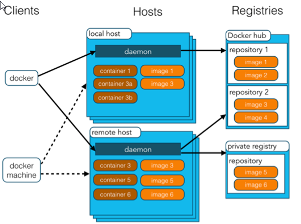
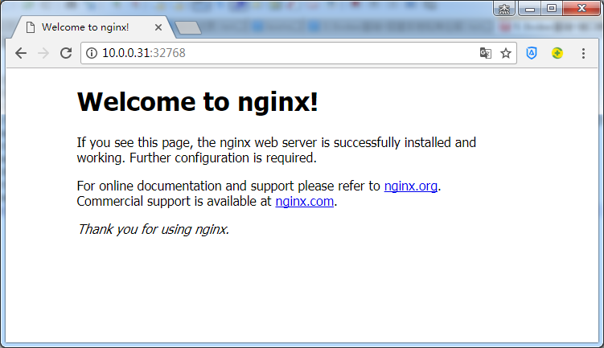

# Docker入门

## 1、简介

### 1）docker是什么

**Docker**是一个开源的应用容器引擎，基于 [Go 语言](http://www.runoob.com/go/go-tutorial.html) 并遵从Apache2.0协议开源；是一个轻量级容器技术；

Docker支持将软件编译成一个镜像；然后在镜像中各种软件做好配置，将镜像发布出去，其他使用者可以直接使用这个镜像；

运行中的这个镜像称为容器，容器启动是非常快速的。另外，容器是完全使用沙箱机制，相互之间不会有任何接口,更重要的是容器性能开销极低。


### 2）dokcer优点

**高效地构建应用**；

**可以在任意地方正常运行**

​	对开发和运维（devop）人员来说，最希望的就是一次创建或配置，可以在任意地方正常运行。

​	开发者可以使用一个标准的镜像来构建一套开发容器，开发完成之后，运维人员可以直接使用这个容器来部署代码。Docker 可以快速创建容器，快速迭代应用程序，并让整个过程全程可见，使团队中的其他成员更容易理解应用程序是如何创建和工作的；

**更轻松的迁移和扩展**

​	Docker 容器几乎可以在任意的平台上运行，包括物理机、虚拟机、公有云、私有云、个人电脑、服务器等。 这种兼容性可以让用户把一个应用程序从一个平台直接迁移到另外一个。

**更简单的管理**

​    	使用 Docker，只需要小小的修改，就可以替代以往大量的更新工作。所有的修改都以增量的方式被分发和更新，从而实现自动化并且高效的管理。

## 2、核心概念

docker主机(Host)：安装了Docker程序的机器（Docker直接安装在操作系统之上）；

docker客户端(Client)：连接docker主机进行操作；

docker仓库(Registry)：用来保存各种打包好的软件镜像；

docker镜像(Images)：软件打包好的镜像；放在docker仓库中；

docker容器(Container)：镜像启动后的实例称为一个容器；容器是独立运行的一个或一组应用



使用Docker的步骤：

1）、安装Docker

2）、去Docker仓库找到这个软件对应的镜像；

3）、使用Docker运行这个镜像，这个镜像就会生成一个Docker容器；

4）、对容器的启动停止就是对软件的启动停止；

## 3、安装Docker

#### 1）、安装linux虚拟机

​	1）、VMWare、VirtualBox（安装）；

​	2）、导入虚拟机文件centos7-atguigu.ova；

​	3）、双击启动linux虚拟机;使用  root/ 123456登陆

​	4）、使用客户端连接linux服务器进行命令操作；

​	5）、设置虚拟机网络；

​		桥接网络===选好网卡====接入网线；

​	6）、设置好网络以后使用命令重启虚拟机的网络

```shell
service network restart
```

​	7）、查看linux的ip地址

```shell
ip addr
```

​	8）、使用客户端连接linux；

#### 2）、在linux虚拟机上安装docker

步骤：

```shell
1、检查内核版本，必须是3.10及以上
[root@localhost ~]# uname -r
2、安装docker
[root@localhost ~]# yum install docker
3、输入y确认安装
4、启动docker
[root@localhost ~]# systemctl start docker
[root@localhost ~]# docker -v
Docker version 1.12.6, build 3e8e77d/1.12.6
5、开机启动docker
[root@localhost ~]# systemctl enable docker
Created symlink from /etc/systemd/system/multi-user.target.wants/docker.service to /usr/lib/systemd/system/docker.service.
6、停止docker
[root@localhost ~]# systemctl stop docker
```

## 4、Docker常用命令&操作

### 1）、镜像操作

| 操作 | 命令                                            | 说明                                                     |
| ---- | ----------------------------------------------- | -------------------------------------------------------- |
| 检索 | docker  search 关键字  eg：docker  search redis | 我们经常去docker  hub上检索镜像的详细信息，如镜像的TAG。 |
| 拉取 | docker pull 镜像名:tag                          | :tag是可选的，tag表示标签，多为软件的版本，默认是latest  |
| 列表 | docker images                                   | 查看所有本地镜像                                         |
| 删除 | docker rmi image-id                             | 删除指定的本地镜像                                       |

查看镜像名及命令       https://hub.docker.com/

镜像加速： https://www.docker-cn.com/registry-mirror

​	加速命令：docker pull registry.docker-cn.com/library/镜像名

​	栗子：docker pull registry.docker-cn.com/library/tomcat

### 2）、容器操作

软件镜像（安装程序）----运行镜像----产生一个容器（正在运行的软件）；

步骤：

````shell
1、搜索镜像
[root@localhost ~]# docker search tomcat
2、拉取镜像
[root@localhost ~]# docker pull tomcat
3、根据镜像启动容器
[root@localhost ~]# docker run --name mytomcat -d tomcat:latest
4、查看运行中的容器
[root@localhost ~]# docker ps 
5、 停止运行中的容器
 docker stop  容器的id
6、查看所有的容器
 docker ps -a
7、启动容器
 docker start 容器id
8、删除一个容器
 docker rm 容器id
9、启动一个做了端口映射的tomcat（'重要）
[root@localhost ~]# docker run -d -p 8888:8080 tomcat
-d：后台运行
-p: 将主机的端口映射到容器的一个端口    主机端口:容器内部的端口

'说明:' 关于端口映射实现访问容器(参看4-4)

10、为了演示简单关闭了linux的防火墙
 原因：防火墙户会拦截某些端口号,在和Linux通信的时候,往往会先关闭防火墙,减少一些通信验证的麻烦.
 注意：在实际工作中，web服务器关闭防火墙一定要谨慎，避免服务器感染病毒
 service firewalld status ；查看防火墙状态
 service firewalld stop：关闭防火墙
11、查看容器的日志
docker logs container-name/container-id

更多命令参看
https://docs.docker.com/engine/reference/commandline/docker/
可以参考每一个镜像的文档
````

### 3）、安装MySQL示例

错误的启动

```shell
[root@localhost ~]# docker pull mysql
[root@localhost ~]# docker run --name mysql01 -d mysql
42f09819908bb72dd99ae19e792e0a5d03c48638421fa64cce5f8ba0f40f5846

'...mysql退出了
[root@localhost ~]# docker ps -a
CONTAINER ID        IMAGE               COMMAND                  CREATED             STATUS                           PORTS               NAMES
42f09819908b        mysql               "docker-entrypoint.sh"   34 seconds ago      Exited (1) 33 seconds ago                            mysql01
538bde63e500        tomcat              "catalina.sh run"        About an hour ago   Exited (143) About an hour ago                       compassionate_
goldstine
c4f1ac60b3fc        tomcat              "catalina.sh run"        About an hour ago   Exited (143) About an hour ago                       lonely_fermi
81ec743a5271        tomcat              "catalina.sh run"        About an hour ago   Exited (143) About an hour ago                       sick_ramanujan


//错误日志
[root@localhost ~]# docker logs 42f09819908b
error: database is uninitialized and password option is not specified 
  You need to specify one of MYSQL_ROOT_PASSWORD, MYSQL_ALLOW_EMPTY_PASSWORD and MYSQL_RANDOM_ROOT_PASSWORD；这个三个参数必须指定一个（指定密码，允许空密码，随机密码）
```

正确的启动

```shell
[root@localhost ~]# docker run --name mysql01 -e MYSQL_ROOT_PASSWORD=123456 -d mysql
b874c56bec49fb43024b3805ab51e9097da779f2f572c22c695305dedd684c5f
[root@localhost ~]# docker ps
CONTAINER ID        IMAGE               COMMAND                  CREATED             STATUS              PORTS               NAMES
b874c56bec49        mysql               "docker-entrypoint.sh"   4 seconds ago       Up 3 seconds        3306/tcp            mysql01
```

做了端口映射

```shell
[root@localhost ~]# docker run -p 3306:3306 --name mysql02 -e MYSQL_ROOT_PASSWORD=123456 -d mysql
ad10e4bc5c6a0f61cbad43898de71d366117d120e39db651844c0e73863b9434
[root@localhost ~]# docker ps
CONTAINER ID        IMAGE               COMMAND                  CREATED             STATUS              PORTS                    NAMES
ad10e4bc5c6a        mysql               "docker-entrypoint.sh"   4 seconds ago       Up 2 seconds        0.0.0.0:3306->3306/tcp   mysql02
```

几个其他的高级操作

```shell
docker run --name mysql03 -v /conf/mysql:/etc/mysql/conf.d -e MYSQL_ROOT_PASSWORD=my-secret-pw -d mysql:tag
把主机的/conf/mysql文件夹挂载到 mysqldocker容器的/etc/mysql/conf.d文件夹里面
改mysql的配置文件就只需要把mysql配置文件放在自定义的文件夹下（/conf/mysql）

docker run --name some-mysql -e MYSQL_ROOT_PASSWORD=my-secret-pw -d mysql:tag --character-set-server=utf8mb4 --collation-server=utf8mb4_unicode_ci
指定mysql的一些配置参数
```


## 5、关于对上文一些命令、术语的补充说明

### 1）端口映射与容器互联 

​	在启动容器的时候，如果不指定对应的参数，在容器外部是无法通过网络来访问容器内部的网络应用和服务的。
　　当容器中运行一些网络应用，要让外部访问这些应用时，可以通过-p或-P参数来指定端口映射。当使用-P(大写P)标记时，Docker会随机映射一个端口到内部容器开放的网络端口(端口范围在Linux系统使用的端口之外，一般都过万)。

示例说明：

~~~shell
[root@docker ~]# docker run -d --name nginx_1 -P nginx:latest 
f769af3e98478b27b87e008f3ad785e2055da4047442c4a8dcb8f621f810dbea
[root@docker ~]# docker ps
CONTAINER ID        IMAGE               COMMAND                  CREATED             STATUS              PORTS                   NAMES
f769af3e9847        nginx:latest        "nginx -g 'daemon ..."   3 seconds ago       Up 2 seconds        0.0.0.0:32768->80/tcp   nginx_1

也可具体指定：
[root@docker ~]# docker run -d --name nginx_1 -p 32768:80  nginx:latest 
~~~

​	通过docker ps可以看到nginx_1容器的80端口被映射到本机的32768端口上。访问宿主主机的32768端口就可以访问容器内的应用程序提供的Web界面：



更多请参考：(https://www.cnblogs.com/jie-fang/p/7920863.html)

## 6、其他高级命令与技巧拓展

参考：https://www.jianshu.com/p/0231568ab335         作者：  [BGbiao](https://www.jianshu.com/u/9c46ece5b7bd)


